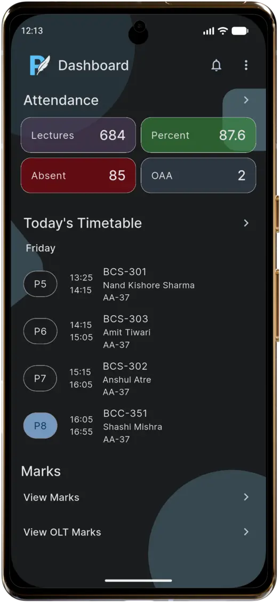
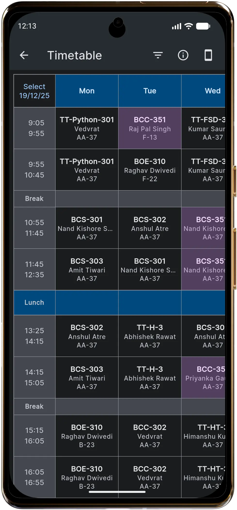
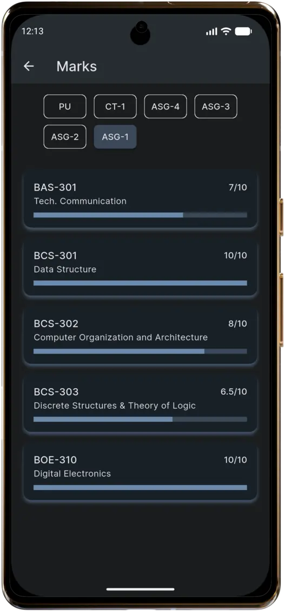
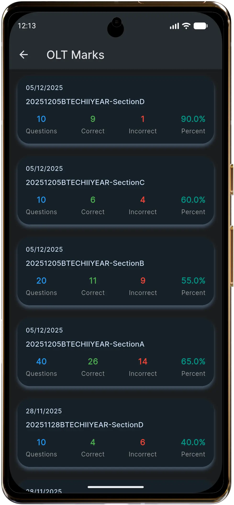
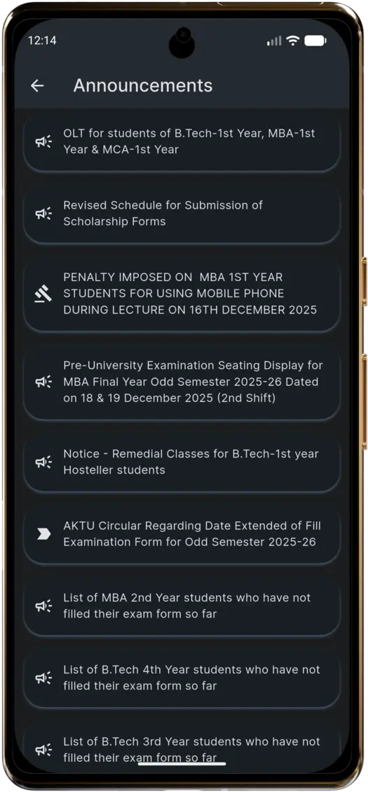

# PSIT Lite (Demo)
[](https://psitlite.space)
 

A lightweight Flutter app designed to provide fast access to essential academic information like attendance, marks, and class schedules.

> ⚠️ **Public Demo Notice**  
> This repository contains a UI/UX demo version of the app.  
> Backend services and production APIs are intentionally removed and replaced with mock data to protect privacy and security.

This repository is intended as a portfolio demonstration.

## Live App
A production build of this app (with backend services enabled) is actively used by PSIT students.

 [](https://psitlite.space)

## Why I built this
The existing college ERP app had performance and usability issues.  
This project explores whether a faster, cleaner ERP experience could be built using Flutter, with a focus on performance, clarity, and offline usability.

Key goals:
- **Speed** – faster load times and smoother navigation
- **Simplicity** – only the most-used academic features
- **Convenience** – one tap access to all features

## Features
- 📊 Attendance overview
- 📅 Daily timetable
- 📝 Marks summary
- 💻 OLT (Online Test) Results
- 📢 Announcements
- ⚡ Offline-first caching
- 🌙 Dark mode

## Architecture & Implementation
The app intentionally avoids heavy state-management frameworks to keep the codebase lightweight, explicit, and easy to reason about.

- `setState` for local UI state and simple interactions  
- `ChangeNotifier` for shared and cross-screen state  
- Modular, reusable widgets with clear separation between presentation and data layers  
- Offline-first design using local caching to minimize load times and improve reliability  
- Explicit state handling to enhance debuggability and predictability

## Screenshots
<table align="center">
  <tr>
    <th align="center">Dashboard</th>
    <th align="center">Attendance</th>
    <th align="center">Timetable</th>
  </tr>
  <tr>
    <td></td>
    <td></td>
    <td></td>
  </tr>
  <tr>
    <th align="center">Marks</th>
    <th align="center">OLT Marks</th>
    <th align="center">Announcements</th>
  </tr>
  <tr>
    <td></td>
    <td></td>
    <td></td>
  </tr>
</table>

## Running the Demo

1. **Clone the repo:**
   
```bash
  git clone https://github.com/adiora/psitlite-demo.git
```

2. **Install dependencies:**

```bash
  flutter pub get
```
3. **Run the app:**
```bash
flutter run
```
4. **Demo Login**

    **User ID:** `2400123`  
    **Password:** `pass`

No additional setup is required since all data is mocked.